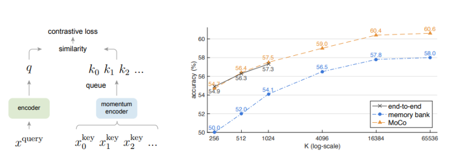

# Momentum-Contrast-and-PyTorch-Lightning-for-Self-Supervised-Learning-on-Images
Momentum Contrast (MoCo) for self-supervised learning on an image dataset

In these notebooks we explore a custom Self-Supervised Learning library in Python (Lightly - https://github.com/lightly-ai/lightly, https://docs.lightly.ai/self-supervised-learning/) and the integration of the Lightly library with PyTorch Lightning. PyTorch Lightning is a high-level framework built on top of PyTorch. Lightning is designed to abstract away the boilerplate code required for deep learning projects, allowing Lightning users to focus more on the research and less on the underlying engineering complexity.

Self-supervised learning (SSL) has emerged as a powerful strategy for scaling up the amount of data that can be leveraged for training machine learning models. In SSL labels are generated from unlabeled datasets by ingeniously leverages properties of the data itself. This facilitates the learning of rich representations without the need for manually annotating datasets.

Contrastive learning is an SSL approach that teaches a model to distinguish between similar (positive) and dissimilar (negative) pairs of data points. It relies on creating embeddings in a way that similar or "positive" pairs are brought closer together, while dissimilar or "negative" pairs are pushed apart in the embedding space. This is achieved through a contrastive loss function, such as Noise Contrastive Estimation (NCE) or Triplet Loss.

Momentum Contrast (MoCo) is a specific instantiation of contrastive learning designed to address the challenge of having a large and consistent set of negative examples. MoCo achieves this by maintaining a dynamic dictionary of data samples, using a momentum-updated encoder. This strategy allows for a larger and more consistent set of negatives over batches, improving the quality of the learned representations. MoCo can be seen as enhancing the scalability and effectiveness of contrastive learning methods.

# **Momentum Contrast (MoCo) Self-Supervised Learning for Feature Extraction from Images**

**Momentum Contrast (MoCo)** is a **self-supervised learning** framework that can learn visual representations from unlabeled images. 

**MoCo** is built around two concepts that differentiate it from earlier self-supervised learning methods:

**Dynamic Dictionary**: MoCo utilizes a queue-based dynamic dictionary of encoded representations, allowing for a consistent and extensive set of negative samples. This innovative approach enables effective learning from a broader range of data without necessitating large batches.

**Momentum Encoder**: The framework employs a dual-encoder structure, comprising a query encoder and a key encoder. While the query encoder updates through standard backpropagation, the key encoder updates are governed by a momentum-based mechanism. This ensures that the encoded representations evolve smoothly over time, enhancing the stability and effectiveness of the learning process.

In **this notebook**, we apply the MoCo framework to the **CIFAR-10** dataset (download available from Kaggle,  https://www.kaggle.com/swaroopkml/cifar10-pngs-in-folders), a collection of 60,000 32x32 color images in 10 classes, with 6,000 images per class. We will begin by ignoring the class labels for CIFAR-10 and pretend it is an unlabeled dataset. Our goal is to showcase how MoCo can be used to learn powerful visual representations from an unlabeled dataset. These extracted representations (i.e., features) can then be leveraged in downstream tasks such as classification, which we will demonstrate by building a linear classifier on the MoCo representations.

### Comparing MoCo to SimCLR

SimCLR (Simple Framework for Contrastive Learning of Visual Representations) and Momentum Contrast (MoCo) are both self-supervised learning algorithms designed for learning visual representations without labeled data. They rely on contrasting positive pairs (similar or the same images) against negative pairs (different images) to learn features that are invariant to transformations of the input data. Despite sharing the goal of learning effective visual representations in a self-supervised manner, SimCLR and MoCo approach the problem in distinct ways.

**SimCLR**

SimCLR creates a positive pair by applying two separate augmentations (cropping, resizing, color distortion) to the same image, treating them as similar. It then contrasts these positive pairs against negative pairs, which are any other images in the same batch. The key to SimCLR's effectiveness is the use of a large batch size and a rich set of augmentations to generate diverse positive pairs. It employs a simple end-to-end training strategy without the need for a memory bank or a momentum encoder. Instead, it relies heavily on the size of the batch to provide a variety of negative samples for effective contrastive learning.

**Momentum Contrast (MoCo)**

MoCo, on the other hand, introduces a dynamic dictionary with a queue and a momentum-updated encoder to facilitate contrastive learning. The idea is to maintain a consistent and large pool of negative samples without requiring extremely large batch sizes. MoCo uses two networks: a query encoder and a key encoder. The key encoder is updated slowly using the momentum mechanism, which helps in maintaining consistency of the representations over time. This allows MoCo to use a smaller batch size compared to SimCLR, as it can leverage a large and consistent set of negative samples from the queue.

**Comparison and Contrast**

* **Batch Size and Memory**: SimCLR relies on large batch sizes to provide a diverse set of negatives for effective learning, whereas MoCo uses a momentum-updated encoder and a queue to maintain a large and consistent pool of negative samples, allowing for smaller batch sizes.

* **Mechanism**: SimCLR directly contrasts representations within a batch using augmentation-based positive pairs. MoCo, however, uses a dynamic dictionary and a momentum mechanism to maintain a more stable and effective set of negative samples over time.

* **Stability and Performance**: MoCo's use of a momentum encoder provides stability in the representations, which can be particularly beneficial when training for a large number of epochs. SimCLR's performance is heavily dependent on the batch size and the diversity of the augmentations.

* **Complexity**: SimCLR has a simpler end-to-end approach compared to MoCo, which requires maintaining a queue and managing the momentum update mechanism for the key encoder.

In summary, while both SimCLR and MoCo aim to learn robust visual representations by contrasting positive and negative pairs, they differ in their methodologies—SimCLR leveraging large batch sizes and augmentations, and MoCo utilizing a momentum-based encoder and a dynamic dictionary for effective negative sample management. The choice between them can depend on the specific requirements of the task, computational resources available, and the desired balance between simplicity and efficiency.

### **References**

* He, Kaiming, Haoqi Fan, Yuxin Wu, Saining Xie, and Ross Girshick. **"Momentum contrast for unsupervised visual representation learning."** In Proceedings of the IEEE/CVF conference on computer vision and pattern recognition, pp. 9729-9738. 2020.  (MoCo v1)

* Chen, Xinlei, Haoqi Fan, Ross Girshick, and Kaiming He. **"Improved baselines with momentum contrastive learning."** arXiv preprint arXiv:2003.04297 (2020). (MoCo v2)

* Chen, Xinlei, Saining Xie, and Kaiming He. **"An empirical study of training self-supervised vision transformers."** In Proceedings of the IEEE/CVF international conference on computer vision, pp. 9640-9649. 2021. (MoCo v3)

* Chen, Ting, Simon Kornblith, Mohammad Norouzi, and Geoffrey Hinton. **"A simple framework for contrastive learning of visual representations."** In International conference on machine learning, pp. 1597-1607. PMLR, 2020. (SimCLR)